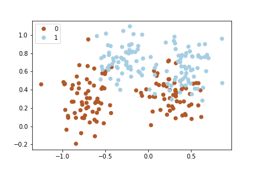
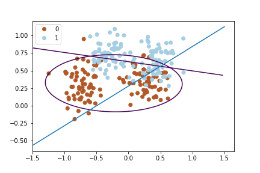
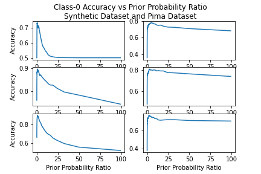

Codes to perform all the operations and generating the plots are in the attached Python notebook. Only results are presented in this file.

# Scatter Plot

# Classification Results

+----------------------+----------------------+------------------------+----------------------+
| Synthetic Dataset    | Euclidean Classifier | Mahalanobis Classifier | Quadratic Classifier |
+:====================:+======================+========================+======================+
| Overall Accuracy     | 0.713                | 0.892                  | 0.898                |
+----------------------+----------------------+------------------------+----------------------+
| Class-0 Accuracy     | 0.68                 | 0.9                    | 0.908                |
+----------------------+----------------------+------------------------+----------------------+
| Class-1 Accuracy     | 0.746                | 0.884                  | 0.888                |
+----------------------+----------------------+------------------------+----------------------+
| Runtime (in seconds) | 0.0241               | 0.0582                 | 0.0673               |
+----------------------+----------------------+------------------------+----------------------+

+----------------------+----------------------+------------------------+----------------------+
| Pima Dataset         | Euclidean Classifier | Mahalanobis Classifier | Quadratic Classifier |
+:====================:+======================+========================+======================+
| Overall Accuracy     | 0.741                | 0.768                  | 0.741                |
+----------------------+----------------------+------------------------+----------------------+
| Class-0 Accuracy     | 0.758                | 0.789                  | 0.803                |
+----------------------+----------------------+------------------------+----------------------+
| Class-1 Accuracy     | 0.706                | 0.724                  | 0.615                |
+----------------------+----------------------+------------------------+----------------------+
| Runtime (in seconds) | 0.00967              | 0.0197                 | 0.0429               |
+----------------------+----------------------+------------------------+----------------------+

# Discussion

The common assumption in all of the analysis is that likelihood and posterior probabilities follow Normal distribution.

## Synthetic Dataset

For the Synthetic dataset, Mahalanobis classifier and quadratic classifier both perform equally well. They even have very similar classification class-wise accuracy. Since Euclidean has most number of assumptions in obtaining the classification scores and posterior probabilities, they have the lowest overall accuracy.

Euclidean classifier assumes that the classes have equal variances. Moreover, it also assumes that the features within the dataset are completely independent from each other. But we can see in the code that they have a correlation of -3.072.

Mahalanobis classifier doesn't assume that the features are independent but does assume that both classes have same variance. Therefore, it has better results than Euclidean distance classifer. The quadratic classifier doesn't assume anything about the correlation matrices. Therefore, it is heaviest computationally.

Matrix multiplications are heavy for CPUs. Although multi-threading is common in today's computers but more dimensions slow down the calculations. When we only had to calculate dot product of two $X-\mu$ vectors, the process was fast. However, as we kept on adding matrix multiplications and inverse calculations, the complexity kept on increasing and thus our runtime increased.

All three methods have balanced class-wise accuracy --- class 0 and class 1 classification accuracy are similar. For Euclidean classifier they are low but still balanced. For the other two methods, they are the almost same.

## Pima Dataset

The classification accuracy for all three methods are relatively low for the Pima dataset. It is highest for the Mahalanobis classifier suggesting that Quadratic discriminant function has overfitting issues. Still it is consistent through the methods. This implies that methods are consistent.

The assumptions on classification methods as described for Synthetic dataset remain the same.

Quadratic classifier has the highest difference between the class-wise accuracy. Quadratic classifier 80% of the "0" labels correctly but only 61% of "1" labels.

Computationally, this dataset is easier for computation than Synthetic dataset as it has fewer observations, although it has more number of features. From my own research, I know that number of observations has stronger effect than number of features. Therefore, the faster runtime can be explained due to faster computational operations.

# Decision Boundaries

It is observed the decision boundaries for Euclidean and Mahalanobis classifiers are straight lines (hyperplanes). The decision boundary for Quadratic classifier is a conic section --- a ellipse in this case.

The straight line in light blue colour is for Euclidean classifier. The violet straight line is from Mahalanobis classifier. Finally, the ellipse in violet colour is for the Quadratic classifier.

The light blue line for Euclidean classifier doesn't look so great --- it misclassifies many points. It confirms why the accuracy was lower for this than other methods.

# Class-0 Accuracy vs Prior Probability Ratio

The above plot gives the accuracy vs prior probability ratio for both datasets and all three methods. Method for the first row is Euclidean, for the second row is Mahalanobis and for the third is for Quadratic.

# Final Discussion

It is noteworthy that the prior probability ratio has an optimal level --- somewhere around 10 --- where it results in the maximum class 0 accuracy. However, we should keep in mind that we are only checking for the class-0 accuracy and if we had to use overall accuracy, we could've decided differently.

This demonstrated how based on what our assumptions we get very different results for each methods. If we assume equal prior probability, we get a different level of accuracy than otherwise. Similarly, we get a different level of accuracy based on what we assume our discriminant function. The runtimes also vary depending on what method we choose.

Different methods come with their own assumptions about the correlation between the features and between the classes. Euclidean assumes equal variance of both classes and no covariance. Mahalanobis assumes that variance and covariances are equal across classes. The assumption is most lax for Quadratic classifier which allows both (or more) classes to have their own classification matrices.

The central assumption in all cases is that we have a Gaussian probability distribution function. The likelihood and posterior probabilities are assumed to be Gaussian distributions. We do not know for sure if that would be so in reality.

In this project, we learn how to analytically decide how classifiers work. We had to make our decision rules based on three major types of discriminant functions. All of them gave us different results and that was a big learning.

# Multi-modal Gaussian Likelihood

As it is obvious from the scatter plot there are two clusters of observations. I decided to have a multimodal Gaussian distribution by summing up two distance functions with two different means but same variance. I repeated this for both classes.

This gave me the overall accuracy as 73.8%, class-0 accuracy as 49.4% and class-1 accuracy as 98.2%. Clearly, our classifier gets very good at finding the "1"s but very poor at finding "0" (worse than coin toss!). The runtime was also high as the same distance had to be calculated twice --- with two cluster points.

Please see attached Python notebook for codes.
